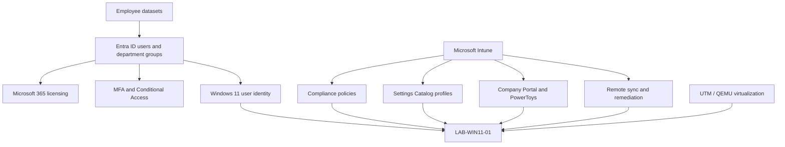

# Environment Architecture

## Scope

Northstar Creative Solutions is a fictional 25-user business in a cloud-first Microsoft 365 lab. The repository demonstrates identity administration and one Windows 11 endpoint; it does not represent a production deployment. See the [business scenario](../docs/business-scenario.md) and [validation summary](../validation/validation-summary.md).

## Component Relationships

The diagram summarizes documented relationships, not a network topology or a claim that compliance-based Conditional Access was configured.

## Identity and Access

- The employee roster covers Executive, Human Resources, Finance, Sales, Marketing, Operations, IT, and Creative Services.
- [Department group validation](../evidence/identity/entra-department-group-membership-validation.png) shows 25 memberships across eight department groups.
- [Role validation](../evidence/identity/entra-least-privilege-admin-role-validation.png) shows Blake Cooper as Helpdesk Administrator and Sam Rivera as User Administrator.
- [Licensing validation](../evidence/identity/m365-business-premium-license-validation.png) records Microsoft 365 licensing counts.
- Conditional Access evidence captures the custom MFA policy in [report-only](../evidence/security/conditional-access-mfa-report-only.png) and [enabled](../evidence/security/conditional-access-mfa-enabled.png) states.
- The [emergency-admin sign-in](../evidence/security/emergency-admin-conditional-access-validation.png) shows successful MFA policy results. It does not establish policy exclusions or a separately tested emergency recovery procedure.

The [identity standards](../docs/identity-access-standards.md) describe intended practices; their lifecycle guidance is not evidence that every joiner, mover, and leaver action was tested.

## Endpoint and Chronology

The original lab narrative identifies UTM / QEMU virtualization. Intune identifies the endpoint as a QEMU virtual machine, with Sam Rivera as its primary user and Personal ownership.

Earlier evidence uses `WIN-8M79HVU6TOU`; later evidence uses `LAB-WIN11-01`, consistent with the documented rename. Preserve both stages: [initial enrollment](../evidence/device-management/intune-device-enrollment-compliant.png) and [renamed endpoint](../evidence/device-management/device-renamed-intune.png). The latter reports remote assistance as not configured.

## Policies and Applications

| Component | Recorded result |
|---|---|
| Default compliance and Windows 11 Baseline Compliance | Both report Compliant |
| Custom compliance settings | Firewall, anti-spyware, antivirus, Defender Antimalware, and real-time protection report Compliant |
| Windows 11 Security Baseline Configuration | Settings Catalog profile reports successful application |
| LAB - Disable Windows Hello for Business | Lab-specific workaround profile reports successful application |
| Company Portal and PowerToys | Required install intent and Installed status |

Sources: [compliance policies](../evidence/device-management/device-compliance-policies.png), [per-setting compliance](../evidence/device-management/windows11-baseline-setting-compliance.png), [configuration status](../evidence/device-management/device-configuration-success.png), and [managed applications](../evidence/device-management/managed-apps-inventory.png).

The profile named “Windows 11 Security Baseline Configuration” is documented as a custom Settings Catalog profile. Its name should not be taken as evidence of deployment of a Microsoft security-baseline template. The [Defender settings report](../evidence/device-management/windows11-security-baseline-success.png) shows setting names and success counts, not their configured values.

## Support and Automation

[Remote synchronization](../evidence/device-management/remote-sync-success.png) records four successful policies, two applications offered, and no script updates. The [Print Spooler case](../docs/print-spooler-remediation.md) connects stopped/running service evidence with an Intune remediation action.

The repository contains a [Graph provisioning script](../scripts/new-entra-users-from-csv.ps1), but its input path and name-column schema need correction before reuse. Original Print Spooler scripts are not committed. See [script limitations](../scripts/README.md).
